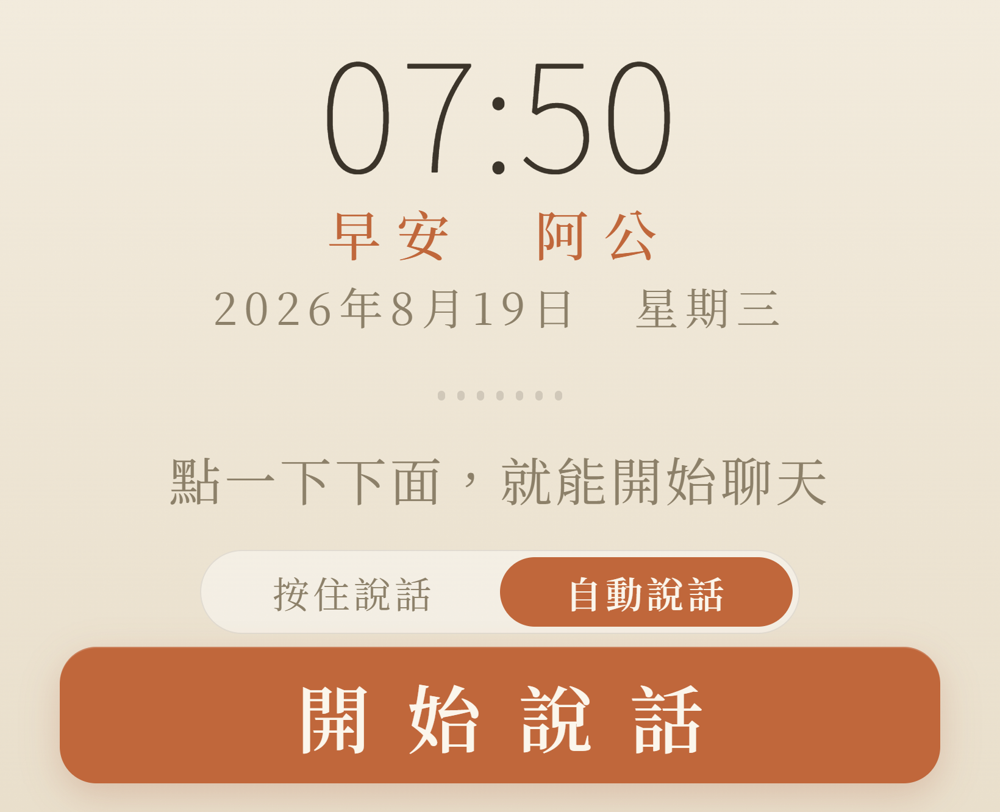
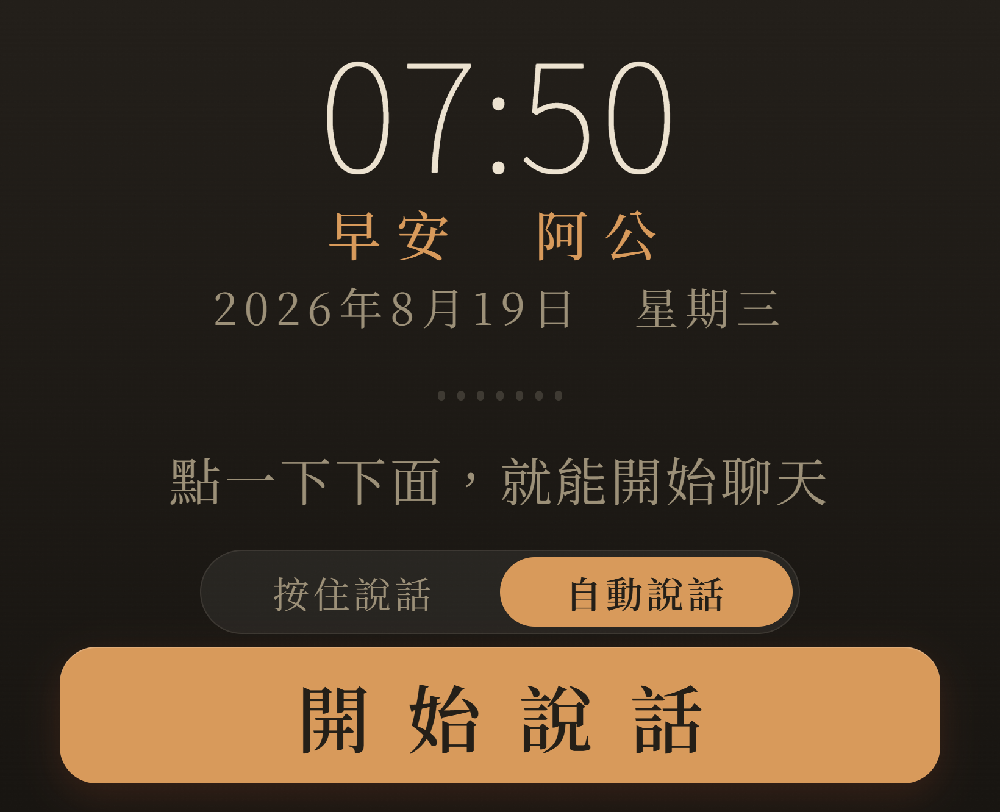
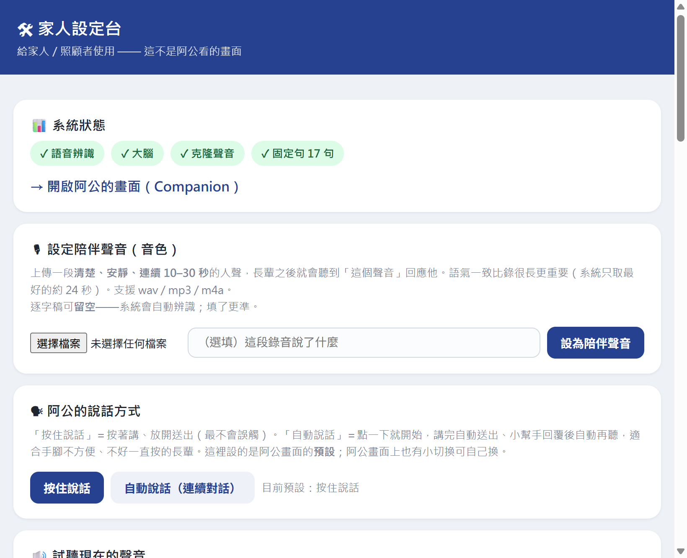

  <a href="README.md">繁體中文</a> · <b>简体中文</b> · <a href="README.en.md">English</a>

<h1 align="center">阿尔茨海默陪伴者 Alzheimer's Voice Companion</h1>

  <b>用最亲的人的声音，陪伴记忆正在远去的长辈。</b>

  
  &nbsp;
  

  
  
  

> **这个项目的起点很私人。**
>
> 我阿公（台湾话的爷爷）有严重的阿尔茨海默，快三年了，常常认错人。把我看成我爸、我叔叔，有时候是叔公，有一次是姨丈。我说过很多次"我是你孙子"，说一百次也没用。
>
> 有一天，我在楼下买了一盒**麦香奶茶**，把吸管叼在嘴里、一边喝一边走进病房，像我小时候那样。他愣了一下，然后笑了："你怎么在这里？有没有用功读书？有没有吃饱？"
>
> 他认出我了。
>
> 原来他要的不是解释。是那个他还认得的画面：一个孙子，叼着吸管喝奶茶。
>
> 我住得很远，没办法天天陪他。所以我想：如果一盒奶茶可以是熟悉的线索，那**熟悉的声音**是不是也可以？
>
> 他可能不记得我是谁。但他记得那个叼着奶茶的孩子。

---

长辈在平板上**按一颗大按钮说话**，系统就用**你设定的家人声音**回他。他问一百次，它就答一百次，不会说"你刚刚问过了"。

## 🚀 三步开始

**长辈端只要一台平板。** 架设在你自己的电脑上，不需要注册账号、不需要服务器。

| | 做什么 | 花多久 |
|---|---|---|
| **1** | 电脑跑一行安装：`powershell -ExecutionPolicy Bypass -File install.ps1` | 看网速，会下载数 GB |
| **2** | 到 [**Releases**](https://github.com/ssps6210/alzheimer-companion/releases) 下载 `elder-companion.apk` 装进平板 | 1 分钟 |
| **3** | 打开 App，扫一下电脑屏幕上的二维码（或按"自动寻找"） | 10 秒 |

没有 NVIDIA 显卡就改跑 `install_cpu.ps1`（纯 Windows、免 WSL，家人的声音一样克隆，只是慢一点）。

**第一次装？** 看 [手把手安装指南](docs/安裝指南.md)，写给非工程师，含前置准备与常见问题（繁体中文；[English](docs/install-guide.en.md)）。

## 📱 界面

  
  &nbsp;&nbsp;
  

长辈界面：一颗大按钮、日／夜自动、待机放老照片　｜　家人设置台 <code>/setup</code>：上传你要的声音

## 🔒 你家人的声音，会怎么被保管

**你录的声音、长辈的照片、他们说过的话，都只留在你自己家里那台电脑。**

我们没有服务器，也没有账号可以注册。就算我们想拿，也拿不到。

三个最常被问到的问题：

**"我爸的声音会被拿去诈骗吗？"**
声音文件从头到尾没有离开过你的电脑。而且系统要设定某个人的声音之前，会要求**本人亲口说一句同意**；听不到那句话就不会设定。另外，它讲出来的每一句话都藏了一个听不见的记号，可以验出"这是 AI 合成的，不是本人说的"。

**"会有人偷听我们的对话吗？"**
对话记录存在你的电脑里，不会上传。只有一件事会连到网络：长辈说完话之后，**文字**（不是声音）会送给 AI 生成回复，就像你在搜索框打字那样。不想要这一步也联网的话，可以改成完全离线，见下方技术细节。

**"我不懂电脑，会不会设定错就泄露了？"**
不会有那个机会——把个人数据传出去的功能，这个项目根本没有写。要泄露得有人故意去改代码。

<b>技术细节（给工程师）</b>

- 声音、照片、`memory.json`、`patterns.json`、同意记录，全部只在本机文件系统，没有任何 outbound 传输路径。
- 唯一的对外调用是 `POST {llm.base_url}/chat/completions`，带对话文字，用使用者自己的 API 密钥。把 `conf.yaml` 的 `llm.base_url` 指向 [Ollama](https://ollama.com) 等本地 OpenAI 兼容端点即可完全离线。
- repo 不含任何个人数据，且每次 push 由 [`tools/privacy_scan.py`](tools/privacy_scan.py) 在 CI 扫描已追踪文件，命中音频／记忆文件／密钥样式就让 build 失败。防的是规则写错与 `git add -f` 这两种实际会发生的状况。
- **家人设定台 `/setup` 有密码**：它能读长辈的完整对话记录，所以一定有锁。首次启动会自动生成一组密码写进 `.env`（`SETUP_PASSWORD`）并印在启动窗口，账号是 `family`。长辈画面 `/` 刻意不设密码——长辈不可能输入密码，那个画面也没有私密内容。
- 同意闸门：同意句必须出现在**成为音色的那一段录音**里，说话者即同意者。可用 `CONSENT_REQUIRED=0` 关闭。
- 水印：[AudioSeal](https://github.com/facebookresearch/audioseal)，跑在 CPU 不占显存，`python tools/detect_watermark.py <音频>` 验证。可用 `WATERMARK=0` 关闭。
  这是**事后可验证性**，不是防护——重新编码有机会把标记洗掉。它的用处是「证明某段音频是合成的」，不是「阻止有心人」。

## ✨ 特色

- 🎙️ **用家人的声音**：上传一段 10–30 秒的清楚录音就换好音色，repo 不含任何人的声音
- 🛡️ **认知障碍照护护栏**：不纠正、不催促；找已故亲人时温柔安抚，不拆穿；说到跌倒或胸口痛会**通报家人**
- 📷 **待机放长辈的老照片**（怀旧疗法）——用照片，不用会动的合成脸
- 📈 **家人看得到近况**：最近常说什么、哪个时段最需要陪伴（是陪伴观察，不是医疗诊断）
- 🧓 **为长者设计**：大按钮、暖色、日夜自动；可选"按住说话"或"自动连续对话"

护栏不只是写在提示词里：[`tests/test_safety.py`](tests/test_safety.py) 用九个高风险情境（问已故亲人、重复发问、要求独自外出…）对真实模型实测回复有没有踩线，改人设必跑。

## 🌏 语言

界面、语音识别与合成、照护护栏、人设，可整套切换：在 `conf.yaml` 设
`language: zh-TW`（默认繁体）／ `zh-CN` ／ `en`。语言包在 [`lang/`](lang/)，
想加语言就复制一份改；没翻到的项目会留着中文，不会变空白。

> 换语言不只是换界面文字——紧急词、禁语这些**护栏关键词也会跟着换**。
> 中文的关键词在英文部署里是无效的，护栏会静默失效，所以它们写在语言包里。

## 🖥️ 配置需求

在一台**架设的电脑**上跑，长辈只要一台有 Chrome 的平板。**推荐一张 NVIDIA 显卡**，语音又快又稳（作者用 RTX 4060 8GB）。没有显卡就用 CPU 版，一样是家人的声音、一样完全本机，速度慢一些。系统 Windows 10 / 11。

技术栈：STT `faster-whisper`（本地）· LLM 任何 OpenAI 兼容端点 · TTS `Qwen3-TTS` 零样本克隆。细节见 [`PROJECT.md`](PROJECT.md)，想一起做见 [`CONTRIBUTING.md`](CONTRIBUTING.md)。

## ☕ 支持

如果它对你或你家人有帮助：⭐ **给个 Star**，让更多正在照顾认知障碍长辈的家庭看到它。

## ⚠️ 免责

**陪伴**工具，**不是医疗器械**，不能取代医疗照护或紧急服务。请由家人监督使用。

## 📄 授权

[MIT](LICENSE) — 自由使用、修改、散布，尤其欢迎用于长者照护等公益用途。
