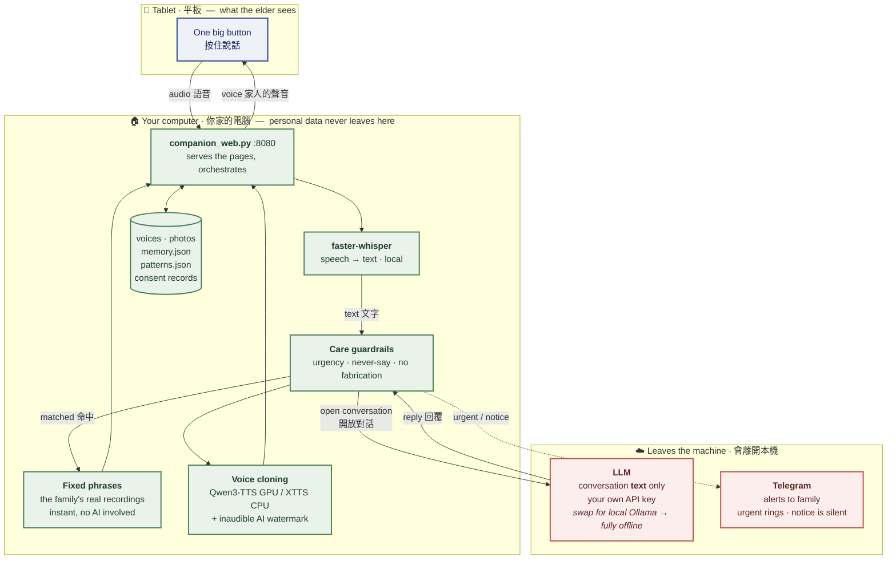

  <b>Architecture</b> · 架構圖

# How it fits together

The one thing worth reading off this diagram: **almost everything happens on the
computer in your home.** The only thing that leaves is the conversation *text*
sent to an AI model, on a key you own — and you can point that at a local model
to keep even this in the house.

> 這張圖最該讀出來的一件事：**幾乎所有事都發生在你家那台電腦上。**
> 唯一離開的是送給 AI 的對話「文字」，用的是你自己的金鑰；
> 想連這一步都留在家裡，把它指向本地模型即可。

## Reading the flow

1. The elder presses one button and speaks. Audio goes to the computer.
2. **Speech becomes text locally** — the recording itself never leaves.
3. **The guardrails run first.** Words like a fall or chest pain alert the family
   straight away, independent of everything else — so an alert never depends on
   the AI having behaved correctly.
4. **Common things skip the AI entirely.** "Time for your medicine" plays a
   recording of an actual family member, instantly.
5. Anything else goes to the LLM as **text**. The reply passes back through the
   guardrails, which intercept a relative's death being revealed before it can
   ever be spoken.
6. The reply is spoken in the **cloned family voice**, watermarked so it can be
   identified as synthetic.

## Why the guardrails sit on both sides

They check what the elder said *and* what the model replied. Prompt instructions
are probabilistic — the same rule is followed most of the time, not every time.
The categories where one failure is unacceptable (revealing a death) therefore
have a deterministic check on the output, not just an instruction in the prompt.

> 護欄同時檢查「長輩說了什麼」和「模型回了什麼」。提示詞是機率性的：
> 同一條規則多數時候有效，不是每次都有效。所以「一次都不能出錯」的那類
> （揭穿死訊），在輸出端還有一道確定性的攔截，不是只靠提示詞。

## Where things live

| | |
|---|---|
| `companion_web.py` | Serves both pages, runs STT, guardrails, memory, alerts |
| `qwen_tts_api.py` | Voice cloning on an NVIDIA GPU, in WSL2 |
| `xtts_cpu_api.py` | Voice cloning on CPU, plain Windows — same HTTP interface, drop-in |
| `wm.py` | AudioSeal watermarking, shared by both voice services |
| `lang/` | Interface text, guardrail keywords and personas per language |
| `tests/` | Nine high-risk care scenarios run against the live model |
| `tools/privacy_scan.py` | Blocks personal data from reaching the repository, in CI |

Full notes, including the potholes already hit, are in
[`PROJECT.md`](../PROJECT.md) (Traditional Chinese).
